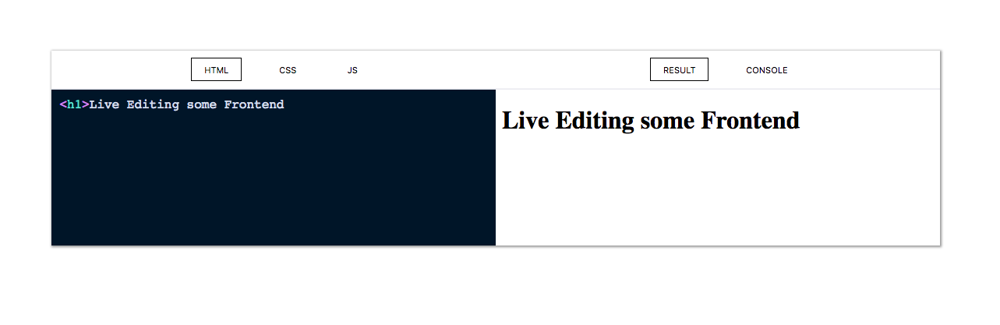

## JS Live

[](https://badge.fury.io/js/react-js-live)

A React Component for live rendering and editing of HTML, CSS and JS.



## Usage

```
npm install react-js-live
```

```jsx
import React from "react";
import JSLive from "react-js-live";
import "react-js-live/build/main.css";

function App() {
  return <JSLive id="test" snippets={snippets} mode="js" />;
}
```

### Props:

1. `id`

A string that uniquely identifies the frame on the page.

2. snippets

Object containing keys: `html`, `css` and `js`. This is the initial code passed into the component.

```js
const snippets = {
  html: `<p>HTML Content goes here</p>`,
  css: `.title { color: red; }`,
  js: `alert(js)`
};
```

3. mode

   default: `js`

   1. `html`:
      Left tab defaults to HTML and Right defaults to Result
   2. `js`
      Left tab defaults to JS and Right tab to Console.

4. `theme`


    default: Night Owl

    Any PrismJS theme.

## Contributing

1. Clone the repo
2. `npm install`
3. `npm start`
